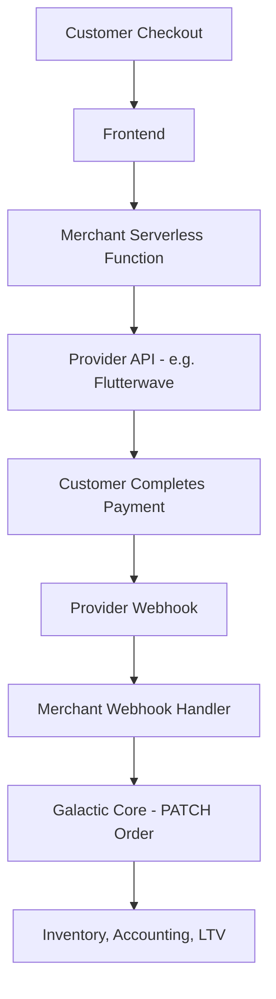

# Merchant Flexibility

Galactic Core is designed to be the programmable source of truth for your commerce operations. While we provide built-in integrations for major providers, we also empower merchants with the flexibility to integrate any third-party service—from local payment gateways to international logistics carriers—using merchant-deployed serverless workers.

---

## 🔐 Custom Payment Providers

> **Pattern**: Merchant-deployed serverless functions for external payment providers  
> **Galactic Core Role**: System of record (orders, inventory, accounting)  
> **Merchant Role**: Payment orchestrator (provider-specific logic)

### Overview
Galactic Core provides built-in integrations for Stripe, PayPal, Paystack, and M-Pesa. For any other provider (Flutterwave, Razorpay, local banks, crypto, etc.), you can deploy your own functions to handle the specific logic while Galactic Core manages the commerce state.

### Architecture


**Key Principle**: Galactic Core doesn't need to know the specifics of your provider. It only needs to receive a verified "paid" or "failed" status update to trigger its internal commerce engines.

### Core Workflow

#### 1. Create Order with Pending Status
Initialize the order in Galactic Core first to get a permanent record and an `order_id`.

```typescript
const timestamp = Math.floor(Date.now() / 1000);
const orderData = {
  customer_id: 'cust_abc',
  items: [...],
  payment_status: 'pending',
  payment_method: 'flutterwave',
  total_amount: 5000
};

// Generate signature on your server
const signature = generateHmacSignature(`${timestamp}.${JSON.stringify(orderData)}`, secret);

const order = await client.orders.createOrder({
  idempotencyKey: 'checkout-123',
  xTimestamp: timestamp,
  xSignature: signature,
  requestBody: orderData
});
```

#### 2. Initialize Payment (Your Function)
Pass the `order_id` to your function to link the provider's transaction to the Tybrite order.

```typescript
// Example: Cloudflare Worker / Supabase Function
export async function initialize(orderId, amount) {
  const payment = await flutterwave.initialize({
    tx_ref: orderId, // Crucial: Link to Tybrite order
    amount: amount,
    redirect_url: 'https://yourstore.com/callback'
  });
  return payment.link;
}
```

#### 3. Handle the Webhook
Securely verify the payment and update the order in Tybrite.

```typescript
// Inside your secure webhook handler
if (status === 'successful') {
  const timestamp = Math.floor(Date.now() / 1000);
  const updateData = {
    payment_status: 'paid',
    payment_reference: transaction_id
  };
  
  const signature = generateHmacSignature(`${timestamp}.${JSON.stringify(updateData)}`, secret);

  await client.orders.updateOrder({
    id: order_id,
    idempotencyKey: `webhook-${transaction_id}`,
    xTimestamp: timestamp,
    xSignature: signature,
    requestBody: updateData
  });
}
```

---

## 🚚 Custom Shipping Workers

### Problem Statement
Standard zone-based shipping works for local delivery, but custom integrations are often needed for external carriers like FedEx, DHL, or regional aggregators.

### Solution Pattern
Merchants can deploy a **Shipping Proxy Worker** that calculates real-time rates from any carrier API and returns them to the frontend.

1.  **Request**: Frontend sends delivery coordinates to the Merchant shipping worker.
2.  **Logic**: Worker calls DHL/FedEx API with weight and destination.
3.  **Response**: Worker returns the exact carrier quote.
4.  **Checkout**: Frontend includes this fee when creating the order in Galactic Core.

---

## Deployment Options

You can deploy these "mid-tier" workers on any modern serverless platform:

*   **Cloudflare Workers**: Edge-optimized and quick to deploy.
*   **Supabase Edge Functions**: Great if you already use Supabase for other logic.
*   **Vercel / Deno Deploy**: Excellent developer experience and fast cold starts.

---

## Security Checklist

<Check>
  **Provider Secrets**: Store all third-party API keys in your platform's secure vault (Secrets).
</Check>
<Check>
  **Webhook Verification**: Always verify signatures from your payment provider to prevent spoofing.
</Check>
<Check>
  **Idempotency**: Use the `Idempotency-Key` when updating Tybrite to ensure retried webhooks don't double-trigger accounting entries.
</Check>

---

## 🏗️ ANVIL Generation

When you request a custom payment integration through **ANVIL**, it generates a ready-to-deploy structure:

```bash
generated-storefront/
├── functions/
│   └── payment-{provider}/
│       ├── initialize.ts      # Create payment intent
│       ├── webhook.ts         # Handle provider callback
│       ├── verify.ts          # Verify payment status
│       └── README.md          # Setup instructions
├── .env.example
└── README.md
```

**Templates Available**: Flutterwave, Razorpay, PayU, Coinbase Commerce, and a Generic template for any other provider.

---

## 📊 Order Metadata Fields

When updating an order from your custom worker, Galactic Core accepts these specific payment-related fields:

| Field | Type | Description |
| :--- | :--- | :--- |
| `payment_status` | `string` | `pending`, `paid`, `failed`, or `refunded`. |
| `payment_method` | `string` | The label for the provider (e.g., `"flutterwave"`). |
| `payment_reference` | `string` | The provider's unique transaction ID. |
| `payment_metadata` | `object` | Optional: Any additional provider-specific data. |

---

## Benefits

*   **Flexibility**: Support any payment provider without waiting for built-in integration.
*   **Control**: You manage the provider relationships, API keys, and contract terms.
*   **Security**: Provider secrets NEVER touch Galactic Core or your frontend.
*   **Performance**: Side effects like **Inventory Sync** and **Accounting** trigger the moment you patch an order to `paid`.

---

## Example: Complete Flutterwave Integration

Implementing a custom provider involves three clear steps:

1.  **Initialize (Frontend)**: Get a checkout link from your serverless function.
    ```typescript
    const response = await fetch('/api/payment/initialize', {
      method: 'POST',
      body: JSON.stringify({
        order_id: 'ord_abc123',
        amount: 5000,
        customer_email: 'customer@example.com'
      })
    });

    const { payment_link } = await response.json();
    window.location.href = payment_link; // Redirect to provider
    ```

2.  **Verify & Update (Webhook)**: Receive the provider's callback and update Tybrite.
    ```typescript
    // Inside your secure Webhook Handler
    if (status === 'successful') {
      const timestamp = Math.floor(Date.now() / 1000);
      const updateData = {
        payment_status: 'paid',
        payment_reference: transaction_id
      };
      
      const signature = generateHmacSignature(`${timestamp}.${JSON.stringify(updateData)}`, secret);

      await tybrite.orders.updateOrder({
        id: tx_ref, 
        idempotencyKey: `flw-webhook-${transaction_id}`,
        xTimestamp: timestamp,
        xSignature: signature,
        requestBody: updateData
      });
    }
    ```

3.  **Tybrite Lifecycle**: The platform automatically handles the commerce side-effects.
    - ✅ **Inventory**: Stocks are reserved/reduced globally.
    - ✅ **Accounting**: Double-entry logs are generated.
    - ✅ **Emails**: Automated order confirmations are dispatched.

---

