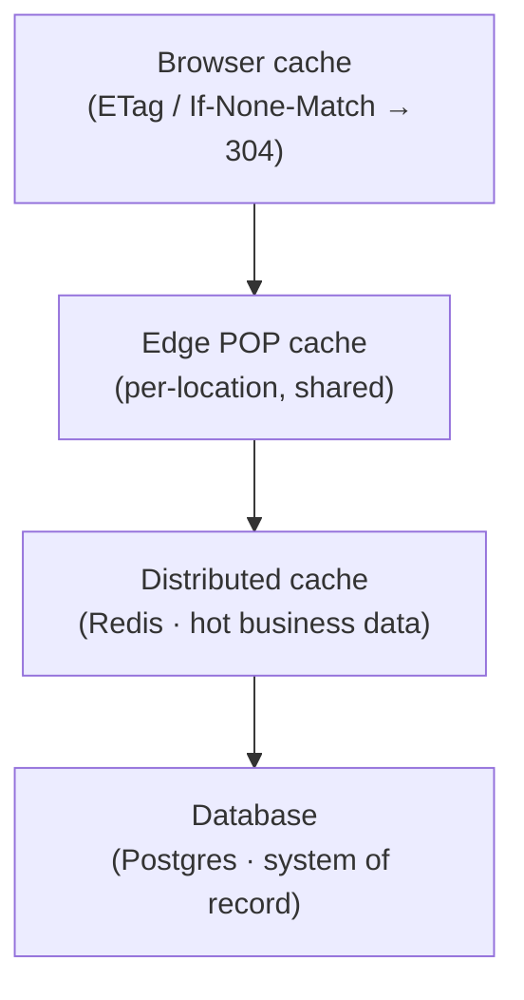

A read passes through as many as four cache layers on its way to the database, and each answers what it
can before handing off. In practice most reads never reach Postgres at all, which is what keeps catalog
and pricing calls in the tens of milliseconds worldwide.

## The four layers

<Frame>

</Frame>

<Steps>
  <Step title="Browser cache (validation)">
    Every cacheable response carries an **ETag**. When the browser already has a copy, it sends
    `If-None-Match`; if nothing changed, the server replies **304 Not Modified** with no body — saving
    the entire payload over the wire.
  </Step>
  <Step title="Edge POP cache (first request per location)">
    The first request from a given region runs the worker and stores the response in that location's edge
    cache. Subsequent requests from the same region are served directly from the edge, with no worker,
    database, or cache round trip. A busy region therefore pays the full cost only on the first request.
  </Step>
  <Step title="Distributed cache (hot data)">
    Business data — the product catalog, pricing rules, currencies — lives in a distributed in-memory
    cache. When the edge misses, the worker reads from here, not the database.
  </Step>
  <Step title="Database (system of record)">
    Only a genuine cold read reaches Postgres, and when it does it's a **single indexed query** against
    a purpose-built read view. The result is then written back up through the cache layers.
  </Step>
</Steps>

## The hot-path budget

An authenticated read is held to a fixed budget: at most one database call and one cache round trip. Two
choices make that possible. First, authentication and tenant scoping are combined into a single database
function, so validating the key does not cost a separate lookup. Second, when many requests for the same
cold entry arrive at one location together, they are coalesced into a single database fetch and the rest
wait on its result, so a cache stampede cannot reach the database more than once.

## Write-through invalidation

Business data — the catalog, pricing rules, currencies — is kept correct by invalidation rather than by
expiry. When a merchant edits a product, changes a price, or adjusts stock, the write path refreshes the
affected entries at once, so the cache reflects the change immediately instead of waiting out a timer.
Correctness never depends on an entry expiring.

Every cached entry still carries a **TTL as a backstop**, though — write-through is the primary mechanism,
not the only one. If an invalidation were ever missed, the entry still ages out on its own (the hot catalog
entries within about fifteen minutes) rather than serving stale data indefinitely. In normal operation you
never see that window, because the write already refreshed the entry; the TTL is the safety net beneath it.

<Note>
  The catalog is cached under **two separate keys** — one for the merchant's in-store/admin view (every
  product, including those not published online) and one for the public storefront view (online-enabled
  products only). Every product or media write busts **both**, so the two surfaces never drift apart.
</Note>

Short-lived external data, such as geolocation lookups and currency snapshots, leans on its TTL directly.
Business data leans on write-through first and the TTL only as a fallback — but in both cases a TTL is
present.

## Warming ahead of the shopper

Write-through keeps a busy store's cache warm on its own: every edit repopulates what it changed. The one
moment a shopper could still pay for a cold read is the first request after a quiet store's entry ages out,
or just after a deployment. To keep even that request fast, the hot storefront entries — the catalog, the
product specifications, and the store's default currency — are refreshed on a short schedule for active
stores, so the entry is already present when the next shopper arrives. Dormant stores are skipped, so the
warming does no work for catalogs no one is browsing. The effect is that the occasional cold-start cost is
absorbed ahead of time rather than landing on a real request.

## Freshness and resilience directives

Public reads carry a `Cache-Control` header that tunes freshness at each layer and adds two resilience
behaviours:

```http
Cache-Control: public, max-age=60, s-maxage=300,
               stale-while-revalidate=600, stale-if-error=86400
```

<Columns cols={2}>
  <Card title="s-maxage — POP holds longer" icon="clock">
    The browser revalidates after `max-age`, but the shared edge cache holds the response for the
    longer `s-maxage` — so the edge keeps serving a hot response to everyone while individual browsers
    revalidate.
  </Card>
  <Card title="stale-while-revalidate" icon="arrows-rotate">
    When an entry goes stale, the edge serves the stale copy **immediately** and refreshes it in the
    background — the shopper never waits for a revalidation.
  </Card>
  <Card title="stale-if-error — serve over a 500" icon="shield-halved">
    If the origin errors (a database hiccup, a worker fault), the edge keeps serving the
    last-known-good response for up to a day. For a catalog, slightly-stale data beats a failed page.
  </Card>
  <Card title="Vary — safe personalization" icon="code-branch">
    Responses that legitimately differ by currency, language, or auth are keyed on those headers, so
    variants never collide in a shared cache. Personalized responses bypass the shared cache entirely.
  </Card>
</Columns>

## What is (and isn't) cached

<Info>
  Only **public, non-personalized** reads are edge-cached: the catalog, product detail, collections,
  specifications, brands, taxonomy, the outbound product feed, semantic content, and non-personalized
  pricing. **Personalized responses** (a per-customer priced list, a customer's own cart or messages)
  and **all writes** are never edge-cached — the cache key is the URL, which doesn't carry the shopper's
  identity, so caching them would risk leaking one shopper's data to another. The platform keys these
  out of the shared cache deliberately.
</Info>

---

<CardGroup cols={2}>
  <Card title="Request Lifecycle" icon="route" href="/how-gc-works/request-lifecycle">
    See where these cache layers sit in the full path of a request.
  </Card>
  <Card title="Scaling & Reliability" icon="earth-americas" href="/how-gc-works/scaling-reliability">
    Read replicas, rate limits, and how the platform holds up under stress.
  </Card>
</CardGroup>
