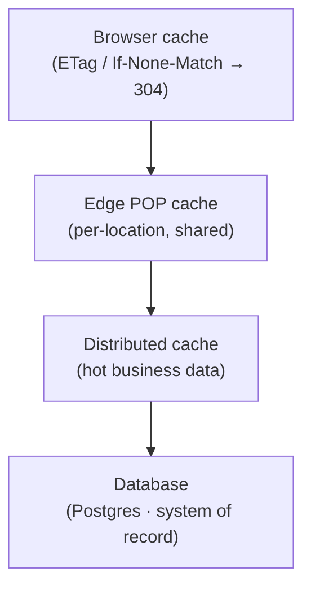

A read passes through as many as four cache layers on its way to the database, and each answers what it
can before handing off. In practice most reads never reach Postgres at all, which is what keeps catalog
and pricing calls in the tens of milliseconds worldwide.

## The four layers

<Frame>

```mermaid
graph TD
    A["Browser cache<br/>(ETag / If-None-Match → 304)"] --> B["Edge POP cache<br/>(per-location, shared)"]
    B --> C["Distributed cache<br/>(hot business data)"]
    C --> D["Database<br/>(Postgres · system of record)"]
```
</Frame>

<Steps>
  <Step title="Browser cache (validation)">
    Every cacheable response carries an **ETag**. When the browser already has a copy, it sends
    `If-None-Match`; if nothing changed, the server replies **304 Not Modified** with no body — saving
    the entire payload over the wire.
  </Step>
  <Step title="Edge POP cache (first request per location)">
    The first request from a given region runs the worker and stores the response in that location's edge
    cache. Subsequent requests from the same region are served directly from the edge, with no worker,
    database, or cache round trip. A busy region therefore pays the full cost only on the first request.
  </Step>
  <Step title="Distributed cache (hot data)">
    Business data — the product catalog, pricing rules, currencies — lives in a distributed in-memory
    cache. When the edge misses, the worker reads from here, not the database.
  </Step>
  <Step title="Database (system of record)">
    Only a genuine cold read reaches Postgres, and when it does it's a **single indexed query** against
    a purpose-built read view. The result is then written back up through the cache layers.
  </Step>
</Steps>

## What an authenticated read is allowed to cost

An authenticated read is held to a fixed ceiling: at most one database call and one cache round trip.
Authentication and tenant scoping are combined into a single database function, so validating the key does
not cost a separate lookup. And when many requests for the same cold entry arrive at one location
together, they are coalesced into a single database fetch and the rest wait on its result, so a cache
stampede cannot reach the database more than once.

## Write-through invalidation

Business data — the catalog, pricing rules, currencies — is kept correct by invalidation rather than by
expiry. When a merchant edits a product, changes a price, or adjusts stock, the write path refreshes the
affected entries at once, so the cache reflects the change immediately instead of waiting out a timer.
Correctness never depends on an entry expiring.

This invalidation reaches **both cache layers**. A stock change — an order placed, a fulfilment shipped,
an inventory edit — refreshes the shared in-memory cache the workers read from *and* purges the matching
response from the shared edge cache in every location, so a shopper anywhere sees the new availability
right away rather than the copy their nearest edge happened to be holding. (Product responses are tagged
so the whole set for a store can be dropped from the edge in one operation the moment its stock moves.)

Every cached entry also carries a TTL. If an invalidation were ever missed, the entry ages out on its own —
the hot catalog entries within about fifteen minutes — rather than serving stale data indefinitely. In
normal operation that window is never reached, because the write already refreshed the entry.

<Note>
  The catalog is cached under **two separate keys** — one for the merchant's in-store/admin view (every
  product, including those not published online) and one for the public storefront view (online-enabled
  products only). Every product or media write busts **both**, so the two surfaces never drift apart.
</Note>

<Note>
  Cache freshness governs the stock figure a shopper is *shown*. The authoritative check happens at
  checkout, when the order is placed against live inventory, so even in the brief moment before a cache
  refresh lands the platform will not let two shoppers buy the last unit.
</Note>

<Warning>
  A cached catalog read shows a shopper what was in stock a moment ago; between that read and their
  checkout, other shoppers may take the last units.
  [`client.orders.reserveStock`](/sdk/api-reference/classes/OrdersService#reservestock) holds the units
  while they pay — atomically, all-or-nothing, returning `409 insufficient_stock` if one is already gone —
  and the hold converts straight into the order at checkout. It is optional, since the final stock check
  at order time prevents an oversell either way; on a busy storefront or a scarce item the difference is
  whether the shopper learns the item is gone before paying or after. The same mechanism carries a limited
  drop, described in [Marketplaces at Scale](/how-gc-works/marketplace-scale#claiming-stock).
</Warning>

Short-lived external data, such as geolocation lookups and currency snapshots, leans on its TTL directly.
Business data leans on write-through first and the TTL only as a fallback — but in both cases a TTL is
present.

## Scheduled warming

Write-through keeps a busy store's cache warm on its own: every edit repopulates what it changed. A cold
read remains possible on the first request after a quiet store's entry ages out, or just after a
deployment. For active stores the hot storefront entries — the catalog, the product specifications, and
the store's default currency — are therefore refreshed on a short schedule, so the entry is already
present when the next shopper arrives and the cold-start cost lands on the schedule rather than on a real
request. Dormant stores are skipped, so the warming does no work for catalogs no one is browsing.

## Freshness and resilience directives

Public reads carry a `Cache-Control` header that tunes freshness at each layer and adds two resilience
behaviours:

```http
Cache-Control: public, max-age=60, s-maxage=300,
               stale-while-revalidate=600, stale-if-error=86400
```

<Columns cols={2}>
  <Card title="s-maxage — POP holds longer" icon="clock">
    The browser revalidates after `max-age`, but the shared edge cache holds the response for the
    longer `s-maxage` — so the edge keeps serving a hot response to everyone while individual browsers
    revalidate. A stock or product change doesn't wait this out: it purges the affected entries from the
    edge immediately (see write-through above), so `s-maxage` only ever governs how long an *unchanged*
    response is served.
  </Card>
  <Card title="stale-while-revalidate" icon="arrows-rotate">
    When an entry goes stale, the edge serves the stale copy **immediately** and refreshes it in the
    background — the shopper never waits for a revalidation.
  </Card>
  <Card title="stale-if-error — the response outlives an origin error" icon="shield-halved">
    If the origin errors — a database hiccup, a worker fault — the edge keeps serving the last-known-good
    response for up to a day rather than returning a `500`.
  </Card>
  <Card title="Vary — safe personalization" icon="code-branch">
    Responses that legitimately differ by currency, language, or auth are keyed on those headers, so
    variants never collide in a shared cache. Personalized responses bypass the shared cache entirely.
  </Card>
</Columns>

## What is (and isn't) cached

<Info>
  Only **public, non-personalized** reads are edge-cached: the catalog, product detail, collections,
  specifications, brands, taxonomy, the outbound product feed, semantic content, and non-personalized
  pricing. **Personalized responses** (a per-customer priced list, a customer's own cart or messages)
  and **all writes** are never edge-cached — the cache key is the URL, which doesn't carry the shopper's
  identity, so caching them would risk leaking one shopper's data to another. The platform keys these
  out of the shared cache deliberately.
</Info>

---

<CardGroup cols={2}>
  <Card title="Request Lifecycle" icon="route" href="/how-gc-works/request-lifecycle">
    See where these cache layers sit in the full path of a request.
  </Card>
  <Card title="Scaling & Reliability" icon="earth-americas" href="/how-gc-works/scaling-reliability">
    Read replicas, rate limits, and how the platform holds up under stress.
  </Card>
</CardGroup>
