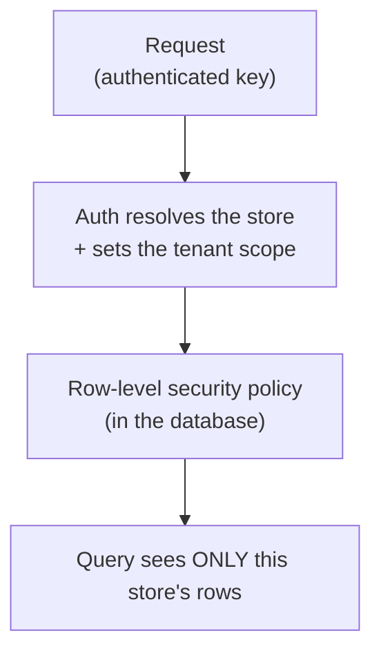

Galactic Core enforces multi-tenancy at two levels: inside a deployment by row-level security, and across
tenants by physical isolation. Neither depends on application code remembering to filter — both guarantees
live in the infrastructure, below the application.

## Every row belongs to a store

The unit of tenancy is the store. Every business table carries a `store_id`, and every query is
constrained to one store — not by a `WHERE store_id = ?` an engineer has to remember, but by row-level
security enforced in the database itself.

<Frame>

</Frame>

When a request authenticates, the platform sets the current store as a transaction-local session variable,
and the database's row-level security policies filter every read and write to that store. A query cannot
reach another store's data, and a bug in application code cannot cross the boundary either, because the
boundary is enforced a layer below the application.

<Note>
  The scoping is transaction-local (safe under connection pooling), so it never leaks between requests
  sharing a pooled connection. Setting the scope is folded into the same single auth call that validates
  the key — no extra round trip. See [Request Lifecycle](/how-gc-works/request-lifecycle).
</Note>

## Postgres is the system of record

A relational Postgres database is the single source of truth for the catalog, orders, customers,
inventory, and accounting. Everything else — the caches, the search index, the recommendation models — is
derived from it and can be rebuilt from it. The cache accelerates reads; it is never authoritative.

Read-heavy access goes through purpose-built read views rather than raw tables. A single query returns a
product with its variants, media, stock, and category joins already assembled, so a catalog read is one
indexed lookup instead of a fan-out of joins assembled at request time.

## Per-deployment isolation

Row-level security separates stores within a deployment; physical isolation separates deployments from one
another. Each deployment — a single merchant on the shared platform, a marketplace operator, or an
enterprise client — runs on its own dedicated stack: a separate database and its own API layer.

<Columns cols={2}>
  <Card title="No co-mingling" icon="box">
    A marketplace operator's data lives in its own database, never in a pool shared with other
    operators. Isolation is a product guarantee, not a query filter.
  </Card>
  <Card title="Contained blast radius" icon="shield-halved">
    One deployment's load spike, migration, or incident cannot affect another's — there is no shared
    database or shared compute to contend for.
  </Card>
  <Card title="Independent scaling" icon="arrows-left-right-to-line">
    A high-volume operator's stack scales independently of everyone else's, and can be placed and
    tuned for its own footprint.
  </Card>
  <Card title="Clean compliance boundary" icon="file-shield">
    Data-residency and compliance obligations map cleanly onto a per-tenant stack rather than a
    shared database that must be reasoned about row by row.
  </Card>
</Columns>

Taken together, these properties cover the confidentiality and integrity sides of the CIA triad:
row-level security and per-deployment isolation keep each tenant's data confidential, and the
server-side pricing authority and ACID writes described in the [Request Lifecycle](/how-gc-works/request-lifecycle)
keep it intact. Availability — the third side — is the subject of
[Scaling & Reliability](/how-gc-works/scaling-reliability).

## Production and sandbox share a stack, not data

A sandbox environment runs alongside production within each deployment, so developers can build against
realistic data without touching real orders. Environment-scoped tables carry an `environment` marker;
production is the default, and only test-keyed API calls write sandbox rows. Sandbox data is purged on a
schedule and never appears in any admin or storefront surface. See [Sandbox](/sandbox).

---

<CardGroup cols={2}>
  <Card title="Scaling & Reliability" icon="earth-americas" href="/how-gc-works/scaling-reliability">
    Read replicas, rate limits, and how the platform holds up under load.
  </Card>
  <Card title="Core Concepts" icon="book" href="/concepts">
    Keys, environments, and the conventions that hold across every endpoint.
  </Card>
</CardGroup>
