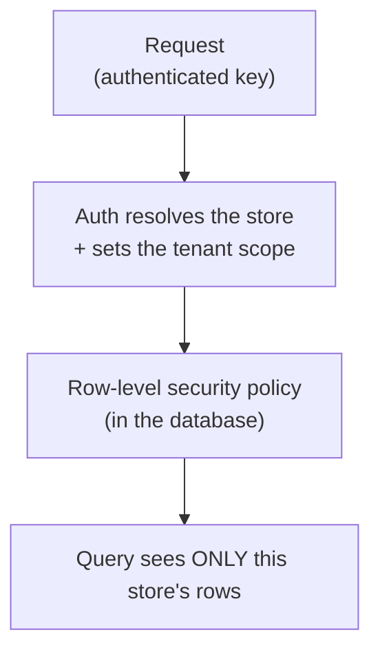

Galactic Core enforces multi-tenancy at two levels: within a shared database by row-level security, and —
for tenants who need it — across separate deployments by physical isolation. Neither depends on application
code remembering to filter; both guarantees live in the infrastructure, below the application.

## Every row belongs to a store

The unit of tenancy is the store. Every business table carries a `store_id`, and every query is
constrained to one store — not by a `WHERE store_id = ?` an engineer has to remember, but by row-level
security enforced in the database itself.

<Frame>

</Frame>

When a request authenticates, the platform verifies the caller is authorized for the store it names and
sets that store as the active scope, and the database's row-level security policies filter every read and
write to it. A query cannot reach another store's data, and a bug in application code cannot cross the
boundary either, because the boundary is enforced a layer below the application.

<Note>
  Authorizing the caller for the store and setting the scope is folded into the same single auth call that
  validates the key — no extra round trip. The scope is re-established per request, so it is bound to the
  authenticated caller and never inferred from a previous one. See
  [Request Lifecycle](/how-gc-works/request-lifecycle).
</Note>

## Postgres is the system of record

A relational Postgres database is the single source of truth for the catalog, orders, customers,
inventory, and accounting. Everything else — the caches, the search index, the recommendation models — is
derived from it and can be rebuilt from it. The cache accelerates reads; it is never authoritative.

Read-heavy access goes through purpose-built read views rather than raw tables. A single query returns a
product with its variants, media, stock, and category joins already assembled, so a catalog read is one
indexed lookup instead of a fan-out of joins assembled at request time.

## Two tiers of isolation

Isolation comes at two levels, and which one applies depends on the tenant, not on the code. Row-level
security separates stores that share a database; a dedicated deployment separates a tenant physically from
everyone else. Most tenants need the first; some need the second.

The **shared platform** is the default. A single merchant runs here: their store shares one multi-tenant
database with many others, and row-level security is the boundary — the same guarantee described above, and
the reason a query can never reach another store's rows. Adding a merchant here adds rows, not a database.

A **dedicated deployment** is for tenants who need physical separation rather than a logical one — a
marketplace operator, an enterprise client, or anyone with a data-residency or compliance requirement that
maps more cleanly onto a separate stack. A dedicated deployment is a database and API layer of its own,
serving one tenant.

<Columns cols={2}>
  <Card title="Shared, RLS-isolated" icon="table-cells">
    On the shared platform, stores live in one database and row-level security keeps each store's data
    private. Isolation is enforced below the application, so a code bug cannot cross it.
  </Card>
  <Card title="Dedicated, physically isolated" icon="box">
    A dedicated deployment's data lives in its own database, never in a pool shared with other tenants —
    a product guarantee rather than a query filter.
  </Card>
  <Card title="Contained blast radius" icon="shield-halved">
    A dedicated deployment's load spike, migration, or incident cannot affect another tenant, because it
    shares no database or compute. On the shared platform, per-store limits and quotas keep one store's
    load from crowding out its neighbours.
  </Card>
  <Card title="Clean compliance boundary" icon="file-shield">
    Data-residency and compliance obligations that are awkward to reason about row by row map cleanly
    onto a dedicated per-tenant stack.
  </Card>
</Columns>

The same codebase serves both tiers, so a tenant can start on the shared platform and graduate to a
dedicated deployment without a rewrite. Taken together, the two tiers cover the confidentiality and
integrity sides of the CIA triad: row-level security and — where it applies — physical isolation keep each
tenant's data confidential, and the server-side pricing authority and ACID writes described in the
[Request Lifecycle](/how-gc-works/request-lifecycle) keep it intact. Availability — the third side — is the
subject of [Scaling & Reliability](/how-gc-works/scaling-reliability).

## Production and sandbox share a stack, not data

A sandbox environment runs alongside production on the same stack a tenant already uses, so developers can
build against realistic data without touching real orders. Environment-scoped tables carry an `environment` marker;
production is the default, and only test-keyed API calls write sandbox rows. Sandbox data is purged on a
schedule and never appears in any admin or storefront surface. See [Sandbox](/sandbox).

---

<CardGroup cols={2}>
  <Card title="Scaling & Reliability" icon="earth-americas" href="/how-gc-works/scaling-reliability">
    Read replicas, rate limits, and how the platform holds up under load.
  </Card>
  <Card title="Core Concepts" icon="book" href="/concepts">
    Keys, environments, and the conventions that hold across every endpoint.
  </Card>
</CardGroup>
