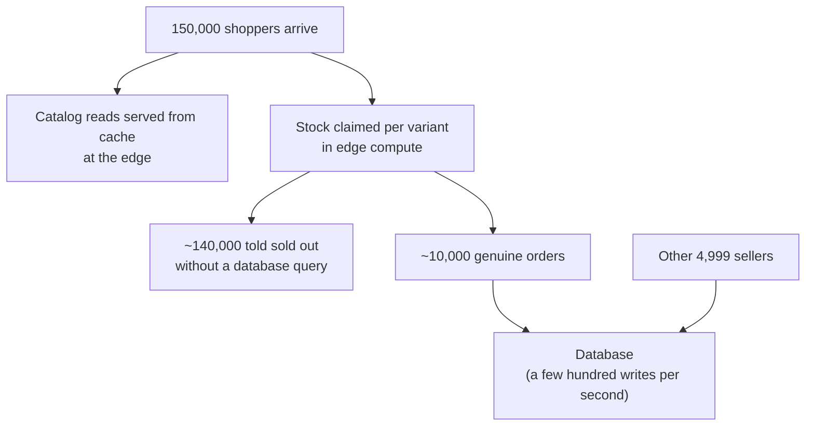

Galactic Core is built to run marketplaces at scale: thousands of sellers on one storefront, an anchor
brand's launch arriving in a single minute, and every other seller trading through it at normal speed.

That holds because of where load is answered. In a marketplace thousands of sellers share one
storefront, one checkout and one database, so their traffic converges on the same rows — and a single
seller's peak is capable of consuming capacity every other seller depends on. The platform resolves the
majority of a spike before it reaches the database at all, and bounds what any one seller can send.

## A drop, traced through the platform

An operator runs five thousand sellers and one anchor brand. The anchor releases a limited product:
a hundred and fifty thousand shoppers arrive within a minute for ten thousand units.

<Frame>

</Frame>

Browsing resolves at the cache. Stock is claimed in edge compute rather than by competing for a database
row, so the shoppers who miss out are answered without a database round trip. The database receives the
orders that actually happened — a few hundred writes per second, against a deployment provisioned for
the operator's own traffic. Other sellers transact against that database throughout at their normal
latency.

<Note>
  **A platform operated by an agency is a different shape.** Its merchants keep their own storefronts,
  catalogues and stock, so they do not contend with each other the way sellers on one marketplace
  storefront do — nothing on this page applies to them. See
  [Growing the platform](/agencies#growing-the-platform).
</Note>

## Two levels of isolation

<Columns cols={2}>
  <Card title="Between operators" icon="server">
    Each marketplace runs on its own stack — its own database, cache, compute and object storage.
    Nothing is shared with another operator, so one marketplace's peak is invisible to every other
    marketplace. Hardware is provisioned for the operator's expected traffic rather than drawn from a
    shared tier.
  </Card>
  <Card title="Between sellers" icon="users">
    Sellers inside a marketplace share a database, so isolation is enforced by the platform: stock
    contention is resolved in edge compute, and each seller's write rate is bounded independently of
    every other seller's.
  </Card>
</Columns>

A shopper can buy from several sellers in one checkout. That produces **one order per seller**, linked
by a shared group reference, rather than a single order spanning sellers. Each order therefore belongs
to exactly one seller for fulfilment, payout, reporting — and for the move described later on this
page, which is why separating a seller never divides an order across two databases.

## Claiming stock

Stock is held by a single-threaded coordinator in edge compute, **one coordinator per variant** — a
specific size and colour, not the product as a whole. Claims for that variant are serialised there
rather than competing for a database row, so a claim that fails — the last unit is gone — returns
without a database round trip. Two shoppers after different sizes never queue behind each other.

Database write volume therefore tracks sales rather than attempts. A hundred and fifty thousand attempts
against ten thousand units produce ten thousand orders' worth of database work. Resolving the same
contention with database locks instead puts thousands of transactions in a queue on one row, and every
other query sharing that database waits behind them.

### What happens to a claim

A successful claim is a **hold**, not yet an order, and it has a defined life:

| Stage | Behaviour |
|---|---|
| **Held** | The claim is written to durable storage before the shopper is told they have it, so a coordinator restart mid-drop neither loses a granted claim nor strands the unit |
| **Expires** | Every hold carries a time limit — fifteen minutes by default. A shopper who claims a unit and abandons checkout has it returned automatically; expiry is swept continuously rather than only on the next claim |
| **Released** | A cancelled checkout returns the unit immediately rather than waiting for expiry |
| **Committed** | Payment succeeds and the hold becomes an order |

Stock is therefore counted in two places — the coordinator and the database — and they are reconciled
continuously. The coordinator re-reads physical stock on a short interval and subtracts the units it
currently holds, so what a shopper can claim is always physical stock **less live holds**. A seller
adjusting inventory mid-drop, a refund, or a cancellation changes the physical figure; holds already
granted are unaffected by it and are never re-offered.

### If a coordinator is unreachable

Claims fall back to resolving in the database. That path is slower under contention, which is the
reason the coordinator exists, and it does not oversell — for a reason worth stating rather than
asserting: **the fallback reserves against the same durable records a coordinator rebuilds from.**

When a coordinator starts, it reads both physical stock and the reservations already standing in the
database, and treats those as holds it did not grant itself. Units claimed while it was unavailable
are therefore already deducted before it answers its first request, and it serves nothing until that
rebuild completes.

The same applies to a coordinator that never stopped. A request can fall back on a timeout while the
coordinator is still running, so reservations granted through the fallback are folded into a live
coordinator on its regular interval, not only at startup.

Between those intervals two shoppers can briefly hold a claim on the same last unit. That resolves at
payment rather than becoming an oversold order: stock is decremented conditionally, so the first
commit succeeds and the second is refused for insufficient stock. The shopper sees a sold-out at
payment, which is a poor moment to see it, but no order is ever accepted for a unit that does not
exist.

## Per-seller write limits

Each store's write rate is counted per minute and capped. A store past its ceiling receives a `429` with
a `Retry-After` header until the window resets; other stores are unaffected. The ceiling is set well
above ordinary trading volume, so it bounds a fault — a sync loop, a runaway script, a bulk import with
no pause — rather than shaping normal use.

**The limit applies to a seller's own writes, not to their shoppers'.** Catalog edits, inventory syncs,
imports and admin changes are counted. Orders placed by shoppers are created through the storefront
path, which is not subject to it — so a drop that generates ten thousand orders in minutes cannot trip
a seller's own ceiling, and the two mechanisms never work against each other.

Read volume is limited separately at the edge, before a request reaches the origin.

<Note>
Limits are configurable per deployment. An operator whose sellers legitimately write more than the
default can raise the ceiling; the mechanism bounds a single tenant's share rather than imposing a fixed
platform-wide quota.
</Note>

## Saturation signals

Memory and processor usage remain healthy until the moment a database stops accepting connections. The
platform reports the signals that move earlier:

| Signal | What it indicates |
|---|---|
| Connection pool held vs actually running | The first hard ceiling. A pool that is nearly full while little is running means connections are being held idle, which has a different cause and a different fix from being busy |
| Transactions left open | A stuck transaction holds its slot and prevents old row versions being cleaned up behind it, degrading reads for every seller |
| Queued work | Backpressure appears in queue depth before it appears in response times |
| Write rate per seller | Which seller is approaching their ceiling, ahead of reaching it |

These appear in the platform administration area alongside per-seller request rates.

## How a marketplace deployment is provisioned

Edge compute, caching and object storage scale horizontally with no configuration, identically for one
seller or five thousand. The database is provisioned to the operator and structured for marketplace
traffic:

<Columns cols={2}>
  <Card title="Reporting reads run on replicas" icon="chart-line">
    Commission, payout and analytics queries are the heaviest reads a marketplace runs, and they are
    served from read replicas rather than the primary. Sellers' checkouts and an operator's month-end
    reporting do not compete for the same capacity.
  </Card>
  <Card title="Order tables are partitioned by seller" icon="table-cells">
    Orders are partitioned on the seller, distributed across a fixed set of partitions rather than one
    per seller — so adding sellers does not add partitions, and a marketplace of five thousand carries
    the same maintenance shape as one of fifty. One seller's rows do not share pages or maintenance
    windows with everyone else's, and it remains one database, so marketplace-wide reporting is a
    single query.
  </Card>
  <Card title="Order writes are queued" icon="layer-group">
    Order creation is queued rather than applied inline, so a surge from one seller becomes latency for
    that seller rather than errors for the marketplace. Queue depth is visible to the operator as it
    happens.
  </Card>
  <Card title="A seller can be moved to their own stack" icon="server">
    A seller who outgrows a shared database can be separated onto dedicated infrastructure while the
    marketplace keeps trading. The first three apply to every seller; this one is reserved for a
    seller who needs it. See below for how the move runs.
  </Card>
</Columns>

## Moving a seller onto dedicated infrastructure

**A drop is not the reason to move a seller.** Peaks are absorbed at the edge and reach the database as
a few hundred writes per second, which is not what exhausts a database. Sustained write volume, table
growth and maintenance pressure are — so separation answers steady-state outgrowth, not a successful
launch. The anchor brand is also the seller whose separation costs the operator most, because their
orders are the largest share of the commission and payout totals that then span two databases.

<Steps>
  <Step title="The new stack is built and brought up to date">
    A dedicated database is provisioned and the seller's catalog, inventory, orders and ledger history
    are copied across, then kept continuously up to date from the live one. The marketplace trades
    normally throughout — at this point the new stack is a follower, and nothing reads from it.
  </Step>
  <Step title="Writes for that seller pause, and queued work drains">
    Once the copy is current, writes for that one seller are held while the last changes finish
    replicating **and any of that seller's queued order writes finish applying**. Both matter: a queued
    write that lands after the switch would apply to the database the seller no longer uses. Every
    other seller continues writing without interruption, and shoppers browsing the moving seller's
    storefront still see it — reads are served from cache throughout.
  </Step>
  <Step title="Routing switches over">
    Requests carrying that seller's identifier are directed to the new stack; every other seller's
    requests continue to the shared one. The held writes are released against the new database. Order
    numbering on the new stack continues above the highest number already issued, so references on
    receipts and in reporting stay unique.
  </Step>
  <Step title="Replication reverses, and a verification window opens">
    At the switch, replication stops flowing to the new stack and begins flowing back from it — one
    direction at a time, never both. For a defined period the old database therefore stays current for
    that seller, so if verification fails routing returns to it with the intervening changes already
    present. The move is reversible for as long as the window is open.
  </Step>
  <Step title="The old rows are retired">
    Once the window closes, the seller's rows on the shared database are removed. The shared database
    is left smaller than it was, and the move is final from that point.
  </Step>
</Steps>

The pause is the only interruption, it applies to one seller, and it is measured in seconds. It exists
because a write landing on the old database after the switch would not exist on the new one, so writes
stop before routing changes rather than after.

### What changes permanently afterwards

Because the old database stays current for that seller while the verification window is open,
marketplace-wide figures continue to come from one place until the move is final. The change below
takes effect when the window closes, not at the switch.

A marketplace-wide figure — commission for the month, a payout run, a report spanning every seller —
then draws on two databases instead of one. The platform assembles those results rather than reading
them from a single place, which means a total that includes the separated seller can lag a few seconds
behind their newest orders.

Per-seller figures are unaffected, and so is anything that seller sees. It is marketplace-wide
aggregates that change, and because those are numbers operators reconcile against payouts, the move is
treated as a deliberate step for a seller who needs it rather than an automatic response to growth.

## Sizing a deployment

Capacity is set from an operator's own forecast — seller count, expected order volume, and the shape of
their peaks. A marketplace expecting regular drops from an anchor brand is provisioned differently from
one with steady traffic across a long tail at the same seller count.

Capacity figures measured on other hardware and other traffic are not published. An operator gets a
deployment sized to their forecast, the signals above from the first day of trading, and headroom
reviewed against their real numbers.

<Card title="Related" icon="book" href="/how-gc-works/scaling-reliability">
  **Scaling & Reliability** covers the platform-wide model: stateless edge compute, caching, rate
  limiting, graceful degradation and recovery.
</Card>
