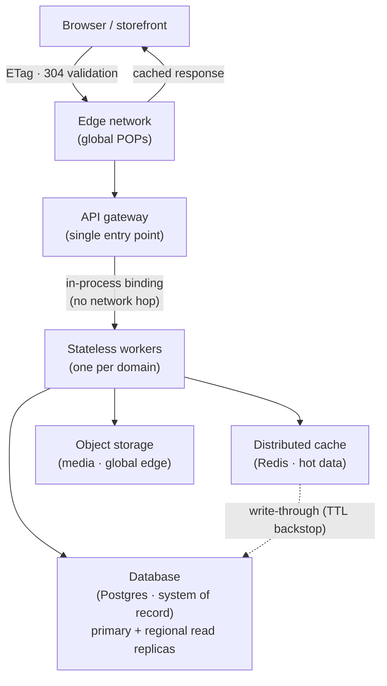

Galactic Core is more than a database with an API in front of it. Reads are served by stateless compute
at the network edge and answered, in most cases, from cache before they ever reach a database. Writes run
a full commerce engine — an order reduces stock, redeems gift cards, posts accounting entries, and updates
customer metrics in one transaction. And every tenant runs on its own isolated stack.

The pages in this section describe how that works, in enough detail to make an architecture decision. If
you have not yet read [Core Concepts](/concepts) — keys, environments, and the conventions that hold
across every endpoint — start there; this section assumes it.

## The shape of the system

<Frame>

</Frame>

A request enters through a single gateway, which routes it to the worker that owns its domain — catalog,
orders, payments, search, and so on. Each layer shields the one beneath it. A catalog read that hits the
edge never reaches a worker; one that reaches a worker usually answers from cache; only a genuinely cold
read reaches Postgres, and even then it is a single indexed query. Catalog and pricing calls return in
tens of milliseconds worldwide, and the database sees a small fraction of total traffic.

Postgres is the system of record. Everything else — the caches, the search index, the recommendation
models — is derived from it and can be rebuilt from it.

## Reads and writes take different paths

The split between reads and writes is the organising idea behind the whole design.

Reads are cacheable and are served from the edge and the distributed cache; they are the bulk of commerce
traffic and rarely touch the database. Writes are the minority, are never edge-cached, and are the only
traffic that must reach the primary. So a surge of shoppers browsing and checking out is dominated by
cache-served reads — the pattern the system is tuned for. The [Caching Pipeline](/how-gc-works/caching)
covers how reads are served; the [Request Lifecycle](/how-gc-works/request-lifecycle) walks through both.

## Where to go from here

<CardGroup cols={2}>
  <Card title="Design Principles" icon="compass-drafting" href="/how-gc-works/design-principles">
    The rules the platform is built on, and why.
  </Card>
  <Card title="Request Lifecycle" icon="route" href="/how-gc-works/request-lifecycle">
    What happens to a read and to a write, step by step.
  </Card>
  <Card title="The Caching Pipeline" icon="layer-group" href="/how-gc-works/caching">
    The cache layers, invalidation, and the resilience directives.
  </Card>
  <Card title="Data Model & Multi-tenancy" icon="database" href="/how-gc-works/data-model">
    Store scoping, row-level security, and per-deployment isolation.
  </Card>
  <Card title="Scaling & Reliability" icon="earth-americas" href="/how-gc-works/scaling-reliability">
    Read replicas, rate limits, idempotency, and graceful degradation.
  </Card>
</CardGroup>

<Note>
  Evaluating GC for a demanding workload? We are glad to review the architecture against your traffic and
  reliability requirements — [support@tybritelabs.com](mailto:support@tybritelabs.com).
</Note>
