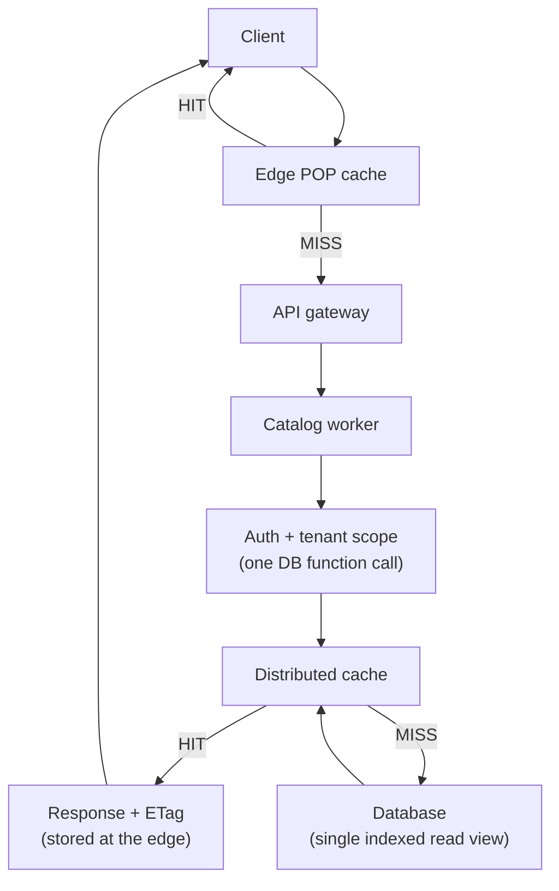
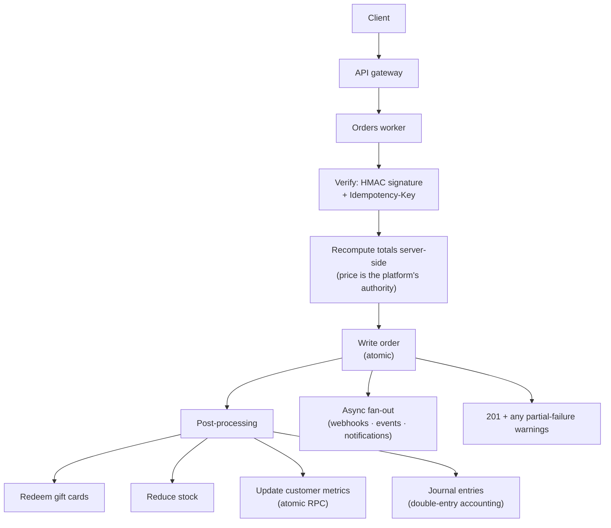

Every request enters through a single API gateway, which routes it to the worker that owns its domain —
catalog, orders, payments, search, and so on. That routing is an in-process binding rather than a network
call, so the hand-off from gateway to worker adds no hop. Reads and writes diverge from there.

## Reading a product

<Frame>

</Frame>

<Steps>
  <Step title="Edge first">
    If the region's edge cache already has this response, it's returned immediately — the request never
    reaches a worker. This is the common case for hot catalog reads.
  </Step>
  <Step title="Gateway → worker">
    On a miss, the gateway routes the request to the catalog worker over an in-process binding (no
    network hop, no re-authentication overhead).
  </Step>
  <Step title="Authenticate + scope in one call">
    The worker validates the API key **and** sets the tenant (store) scope in a single database
    function. Every subsequent query is automatically constrained to that store by row-level security.
  </Step>
  <Step title="Cache, then database">
    The worker reads from the distributed cache. On a cache miss it runs one indexed query against a
    purpose-built read view, then writes the result back through the cache.
  </Step>
  <Step title="Respond with an ETag">
    The response is returned with an `ETag` and cache directives, and stored at the edge so the next
    request from that region is served without a worker at all.
  </Step>
</Steps>

The whole path stays within the hot-path budget of one database call and one cache round trip. Sensitive
fields such as cost, margin, and supplier are stripped before any response leaves the platform.

## Creating an order

A write is never cached and always reaches the database, and it does considerably more than insert a row:
it runs the commerce engine. The order itself and its money math are written in ACID transactions, so a
customer's total, discounts, and gift-card balance are always computed and committed atomically — never
half-applied under concurrency. The operational side effects that follow (stock, accounting, metrics) run
as post-processing, and a failure in one of them is reported rather than rolled back — described below.

<Frame>

</Frame>

<Steps>
  <Step title="Authenticate and verify">
    A sensitive write requires a secret key, and creating or updating an order additionally requires an
    HMAC signature over a timestamp and the request body, within a short replay window. The
    `Idempotency-Key` header makes a retry safe: the same key never produces a second order.
  </Step>
  <Step title="Recompute the totals">
    The worker recalculates totals, discounts, and gift-card redemption in atomic database functions and
    rejects a client-sent price that does not match. Because the server holds the pricing authority, the
    order is safe to place from a browser-adjacent backend.
  </Step>
  <Step title="Write, then run the side effects">
    The order is written, then post-processing runs in a fixed order: redeem gift cards, reduce stock,
    update customer lifetime metrics through a function that stays correct under concurrent orders for
    the same customer, and post the double-entry accounting.
  </Step>
  <Step title="Report any partial failures">
    A failure in post-processing does not roll back a paid order, but it is recorded on the order and
    returned as `post_processing_warnings`, so a partial success is never reported as a clean one.
  </Step>
  <Step title="Fan out the rest asynchronously">
    Work that need not block the response — outbound webhooks, event capture, notifications — is dispatched
    to durable queues. See [Scaling & Reliability](/how-gc-works/scaling-reliability).
  </Step>
</Steps>

<Note>
  **Custom payment and shipping providers** plug into this lifecycle without changing it: your provider
  deploys its own function, creates the order as `pending`, and PATCHes it to `paid` after verifying its
  own webhook — at which point the same post-processing (stock, accounting, metrics) runs. GC only needs
  a verified status transition. See [Extensions](/extensions).
</Note>

---

<CardGroup cols={2}>
  <Card title="The Caching Pipeline" icon="layer-group" href="/how-gc-works/caching">
    A closer look at the cache tiers the read path flows through.
  </Card>
  <Card title="Data Model & Multi-tenancy" icon="database" href="/how-gc-works/data-model">
    How the tenant scope set during auth constrains every query.
  </Card>
</CardGroup>
