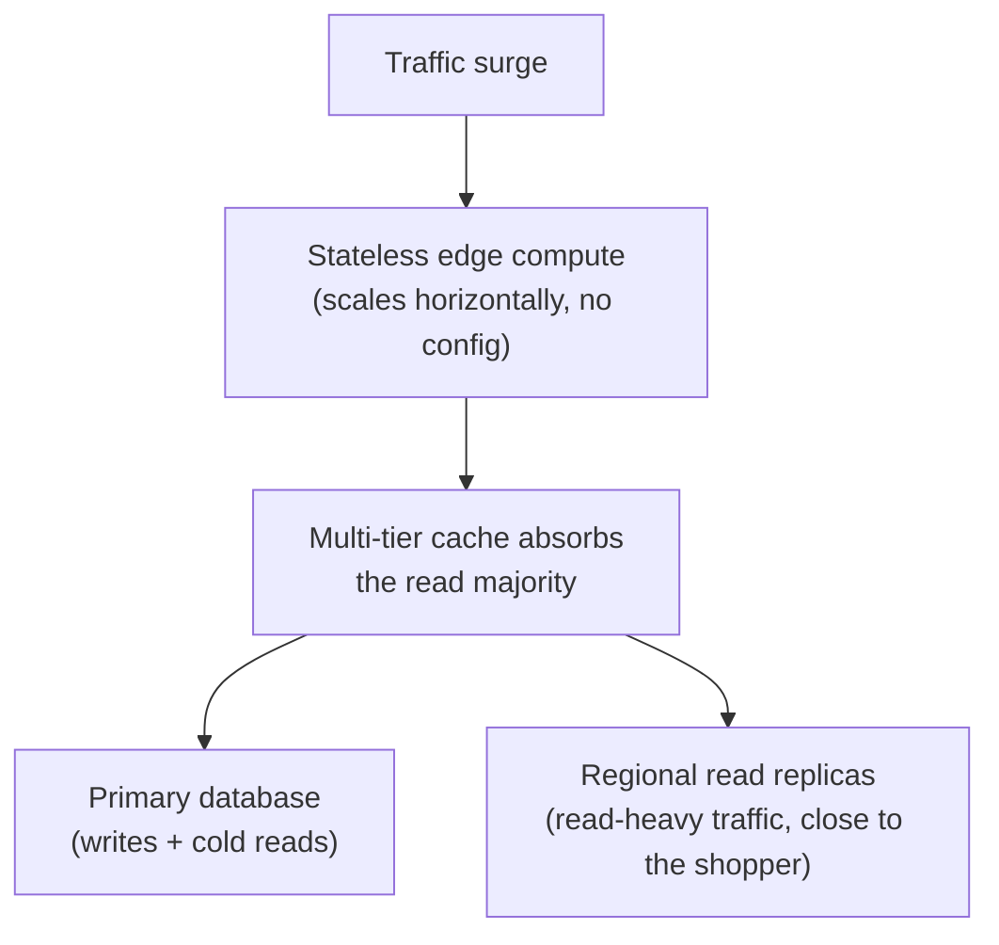

Galactic Core is designed to scale horizontally under load and to degrade gracefully rather than fail
outright. This page covers the properties that matter once traffic is heavy: how the platform scales, how
it limits load, and how it behaves when something goes wrong.

## Scaling

<Frame>

</Frame>

<Columns cols={2}>
  <Card title="Stateless edge compute" icon="bolt">
    Requests are handled by stateless compute in hundreds of locations worldwide, with no per-instance
    state and no configuration to scale. Capacity is added at the edge automatically as traffic rises,
    and the model is identical for one merchant or a marketplace of thousands.
  </Card>
  <Card title="Cache-served reads" icon="layer-group">
    Reads are the bulk of commerce traffic and are served from cache, so a surge of shoppers browsing
    and checking out resolves to a small number of database queries rather than millions. See
    [Caching](/how-gc-works/caching).
  </Card>
  <Card title="Regional read replicas" icon="earth-americas">
    The database runs a primary alongside regional read replicas, so read-heavy traffic is served from a
    replica close to the shopper and the primary is reserved for writes. Reads scale out; writes stay
    consistent.
  </Card>
  <Card title="Isolation as sharding" icon="grip">
    Each deployment runs on its own stack, so adding tenants adds independent capacity rather than
    contending for a shared database — per-deployment isolation is horizontal sharding by design. See
    [Data Model](/how-gc-works/data-model).
  </Card>
</Columns>

In short, the layers that are cheap to scale — edge compute, cache, replicas — carry the load, and the
primary database, the one layer that must stay consistent, sees only writes and genuine cold reads.

## Controlling load

Layered limits protect the platform and every tenant on it, enforced at the edge before a request reaches
the workers or the database.

Rate limits are tiered by key type: publishable keys are limited per IP and per key, secret keys per key,
with tighter limits on sensitive endpoints such as payments and authentication. A throttled request
receives a `429` with a `rate_limited` code rather than a dropped connection. Usage quotas are counted
atomically per store, so plan limits and overage are metered exactly even under concurrent traffic from
many locations at once. The [Core Concepts](/concepts) page documents the response contract.

## Graceful degradation

Under stress the platform aims to return a slower or slightly-stale response rather than an error.

<Steps>
  <Step title="Stale responses during an incident">
    Public catalog responses carry `stale-if-error`, so if the origin has a bad moment the edge keeps
    serving the last-known-good response instead of a `500`. For a catalog, a slightly-stale page is
    almost always preferable to a failed one. The caching directives are covered in
    [The Caching Pipeline](/how-gc-works/caching).
  </Step>
  <Step title="Safe retries">
    Order creation is idempotent: an `Idempotency-Key` ensures a retried request never creates a
    duplicate, so a client whose response was lost in transit can retry without risk.
  </Step>
  <Step title="Consistent under concurrency">
    Totals, discounts, and gift-card redemption are computed in atomic database functions, so
    concurrent orders for the same customer do not produce lost updates or inconsistent balances.
  </Step>
  <Step title="Isolated failures">
    Because each deployment is physically isolated, one tenant's load spike or incident cannot degrade
    another's — there is no shared database or compute to contend for.
  </Step>
</Steps>

## Asynchronous work

Work that need not block the response runs on durable queues, so a transient failure is retried rather
than lost.

<Columns cols={2}>
  <Card title="Outbound webhooks" icon="arrows-rotate">
    Deliveries retry on an exponential backoff that spans minutes to a couple of days across several
    attempts, and an endpoint that keeps failing is disabled by a circuit breaker so it cannot hold up
    the pipeline. See [Webhooks](/webhooks).
  </Card>
  <Card title="Notifications and indexing" icon="bell">
    Merchant notifications, onboarding sequences, and search and recommendation indexing run on durable
    queues drained on a schedule, with retries, delayed sends, and multi-producer fan-in, entirely off
    the request path.
  </Card>
</Columns>

## Backups and recovery

The database is backed up continuously, not just on a nightly snapshot. Alongside regular full backups, a
write-ahead log captures every committed change, which makes point-in-time recovery possible: the database
can be restored to any moment within the retention window — the instant before an accidental bulk delete or
a bad migration, for example — rather than only to the last snapshot. Per-deployment isolation applies here
too: each deployment's backups are its own, so a restore affects one tenant and never reaches across to
another.

<Note>
  Planning for a specific scale or availability target? We are glad to review the architecture against
  your traffic profile and reliability requirements —
  [support@tybritelabs.com](mailto:support@tybritelabs.com).
</Note>

---

<CardGroup cols={2}>
  <Card title="The Caching Pipeline" icon="layer-group" href="/how-gc-works/caching">
    The cache tiers that carry the read load.
  </Card>
  <Card title="Data Model & Multi-tenancy" icon="database" href="/how-gc-works/data-model">
    How per-deployment isolation keeps tenants separate and adds capacity.
  </Card>
</CardGroup>
